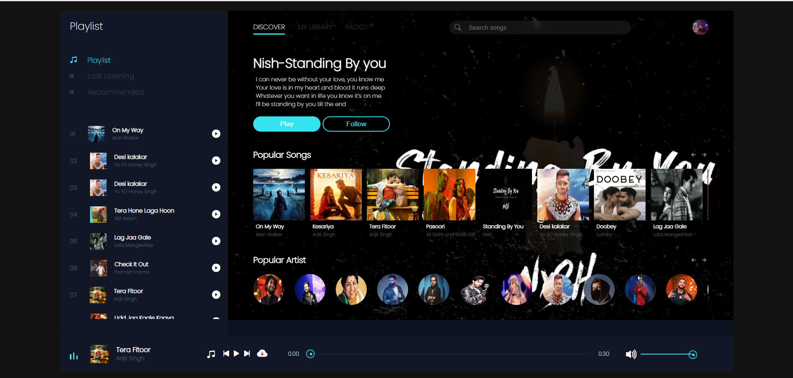

# 🎵 Music Player Web App

A visually stunning and interactive web-based music player built using **HTML**, **CSS**, and **JavaScript**. This music player allows users to play songs, browse playlists, view popular songs and artists—all within a modern dark-themed interface.

Screenshot

## ✨ Features

- 🎶 Interactive song playlist with thumbnails and artist names
- ▶️ Play, pause, forward, and rewind functionality
- 🔊 Volume control and progress bar
- 🕹️ "Now Playing" section with song info
- 💿 Popular songs carousel
- 🎤 Popular artists display section
- 🎨 Fully responsive and dark-themed user interface

---

## 🛠️ Technologies Used

- **HTML5** – Page structure and audio support
- **CSS3** – Styling, layout, responsive design
- **JavaScript (Vanilla JS)** – Functionality and interactivity
- **Audio API** – Used for song playback and progress tracking

---

## 🚀 How to Run

1. Download or clone this repository.
2. Make sure all assets (audio files and images) are in the correct folders (`/audio`, `/images`, etc.).
3. Open the `index.html` file in any modern web browser.
4. Start listening!

---

## 📸 Preview

> Add a screenshot of the homepage and player UI here.

---

## 📌 To-Do

- [ ] Add shuffle and repeat features
- [ ] Implement playlists based on genres
- [ ] Add animations for transitions
- [ ] Store last played song using `localStorage`

---

## 📄 License

This project is open-source and available under the **MIT License**.

---

## 👩‍💻 Developed By

**Akshita Gupta**

---
